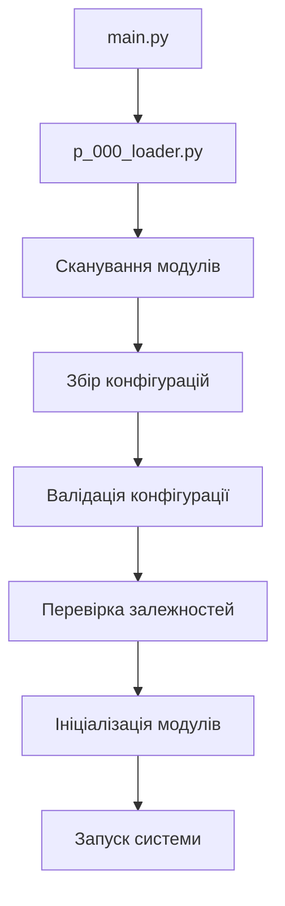
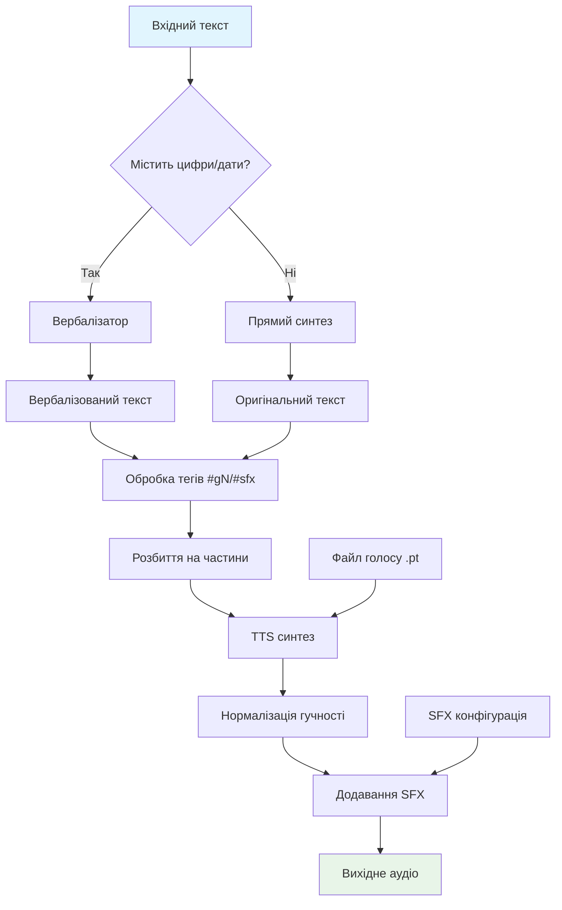

# 🏗️ ПОВНА ДОКУМЕНТАЦІЯ ПРОЄКТУ
*Автоматично згенеровано: 2025-12-12T19:28:10.568855*
*Оновлюється автоматично при кожному запуску системи*

====================================================================================================
## 📊 ЗАГАЛЬНА ІНФОРМАЦІЯ
====================================================================================================
- **Загальна кількість модулів**: 28
- **Секції конфігурації**: 14
- **Активних компонентів**: 35
- **Коренева папка**: D:\TTS\styletts2-ukrainian\007_universal


### 📦 CORE (1 модулів)
- `[0]` **p_000_loader** - Модуль P_000: ModuleLoader

### 📦 CONFIG (4 модулів)
- `[10]` **p_010_config_collector** - Модуль збирання конфігурацій.
- `[12]` **p_012_config_updater** - Модуль для автоматичного створення та оновлення основного config.yaml.
- `[15]` **p_015_config_tool** - Модуль утиліт для керування конфігурацією.
- `[20]` **p_020_config_validator** - Валідація конфігурації через Pydantic.

### 📦 SERVICES (6 модулів)
- `[50]` **p_050_universal_deps_checker** - Універсальний модуль перевірки залежностей.
- `[60]` **p_060_error_handler** - Модуль для обробки помилок завантаження модулів.
- `[70]` **p_070_event_types** - Загальні типи подій для всієї системи.
- `[75]` **p_075_events** - Система подій для комунікації між модулями.
- `[80]` **p_080_registry** - Реєстр дій для модулів.
- `[90]` **p_090_gui_manager** - Менеджер графічних інтерфейсів.

### 📦 UTILS (1 модулів)
- `[100]` **p_100_logger** - 

### 📦 FEATURES (12 модулів)
- `[303]` **p_303_tts_models** - p_303_tts_models.py - Завантаження та керування моделями TTS
- `[310]` **p_310_tts_config** - Конфігурація TTS модуля.
- `[312]` **p_312_tts_engine** - 
- `[351]` **p_351_sfx_handler** - p_351_tts_sfx_handler.py - Обробник звукових ефектів (SFX) для TTS системи.
- `[352]` **p_352_dialog_parser** - p_352_tts_dialog_parser.py - Парсер сценаріїв Multi Dialog для TTS.
- `[353]` **p_353_advanced_ui_core** - Головний модуль розширеного UI для Multi Dialog TTS.
- `[353]` **p_353_tts_gradio_advanced_ui** - p_353_tts_gradio_advanced_ui.py - Розширений Gradio UI для Multi Dialog TTS.
- `[354]` **p_354_ui_builder** - Конструктор розширеного UI для Multi Dialog TTS.
- `[355]` **p_355_ui_handlers** - Обробники подій для розширеного UI Multi Dialog TTS.
- `[356]` **p_356_ui_styles** - Стилі та теми для розширеного UI Multi Dialog TTS.
- `[357]` **p_357_ui_utils** - Утиліти для розширеного UI Multi Dialog TTS.
- `[400]` **p_400_test_integration** - Тестовий модуль для перевірки інтеграції TTS у фреймворк.

### 📦 INFO (4 модулів)
- `[901]` **p_901_project_info** - Модуль для документування проекту.
- `[902]` **p_902_ai_helper** - p_902_ai_helper.py - Спеціальний модуль для покращення документації під ШІ.
- `[910]` **p_910_github_url_updater** - p_910_github_url_updater.py
- `[996]` **p_996_gui_launcher** - p_996_gui_launcher.py - CLI для вибору та запуску GUI інтерфейсів (високий префі

====================================================================================================
## 🔄 СХЕМА РОБОТИ СИСТЕМИ
====================================================================================================


====================================================================================================
## 🔗 ЗАЛЕЖНОСТІ МІЖ МОДУЛЯМИ
====================================================================================================
- **p_353_advanced_ui_core** ← p_356_ui_styles, p_354_ui_builder
- **p_354_ui_builder** ← p_355_ui_handlers

====================================================================================================
## 🤖 ДЛЯ ШІ: Інтеграція та використання
*Автоматично згенеровано: 2025-12-12 19:28:10*
*Ця секція призначена для AI-помічників (ChatGPT, Claude, тощо)*

---

### 🗺️ Мапа ключів app_context


**Конфігурація:**
  - `010_config_collector` - Сервісний компонент системи (ConfigCollector)
  - `020_config_validator` - Сервісний компонент системи (Config)
  - `config` - Головна конфігурація (Pydantic) (Config)
  - `config_collector` - Сервісний компонент системи (ConfigCollector)
  - `config_models` - Сервісний компонент системи (dict)
  - `config_tool` - Сервісний компонент системи (dict)
  - `config_updater` - Сервісний компонент системи (dict)
  - `raw_config` - Сервісний компонент системи (dict)

**Сервіси:**
  - `action_registry` - Реєстр дій для GUI (ActionRegistry)
  - `error_handler` - Обробник помилок модулів (ErrorHandler)
  - `event_bus` - Шина подій для модулів (EventBus)
  - `logger` - Центральний логер системи (Logger)

**TTS компоненти:**
  - `303_tts_models` - Сервісний компонент системи (TTSModels)
  - `312_tts_engine` - Сервісний компонент системи (dict)
  - `353_tts_gradio_advanced_ui` - Сервісний компонент системи (dict)
  - `tts_engine` - Двигун синтезу мови (TTSEngine)
  - `tts_gradio_advanced_demo` - Сервісний компонент системи (Blocks)
  - `tts_models` - Менеджер моделей TTS (TTSModels)

**Графічні інтерфейси:**
  - `090_gui_manager` - Сервісний компонент системи (GUIManager)
  - `gui_manager` - Менеджер графічних інтерфейсів (GUIManager)

**Утиліти:**
  - `project_info` - Інформація про проект (ProjectInfoCollector)
  - `universal_deps_checker` - Перевірка залежностей (UniversalDependencyChecker)

**Інше:**
  - `050_universal_deps_checker` - Сервісний компонент системи (UniversalDependencyChecker)
  - `060_error_handler` - Сервісний компонент системи (ErrorHandler)
  - `075_events` - Сервісний компонент системи (EventBus)
  - `080_registry` - Сервісний компонент системи (ActionRegistry)
  - `100_logger` - Сервісний компонент системи (Logger)
  - `351_sfx_handler` - Сервісний компонент системи (SFXHandler)
  - `352_dialog_parser` - Сервісний компонент системи (DialogParser)
  - `353_advanced_ui_core` - Сервісний компонент системи (dict)
  - `400_test_integration` - Сервісний компонент системи (dict)
  - `901_project_info` - Сервісний компонент системи (ProjectInfoCollector)
  - `advanced_ui_initialized` - Сервісний компонент системи (bool)
  - `available_voices` - Сервісний компонент системи (list)
  - `dialog_parser` - Сервісний компонент системи (DialogParser)
  - `modules` - Сервісний компонент системи (list)
  - `sfx_handler` - Сервісний компонент системи (SFXHandler)

---


### 🔄 Робочий процес TTS системи




---


### 🎙️ Приклад 1: Базовий синтез мови
```python
# Отримати TTS двигун з контексту
tts_engine = app_context['tts_engine']

# Простий синтез
result = tts_engine.synthesize(
    text="Привіт, це тестовий синтез українською мовою.",
    speaker_id=1,
    speed=0.88
)

# Результат містить:
# - result['audio'] - numpy масив аудіо
# - result['sample_rate'] - частота дискретизації
# - result['duration'] - тривалість в секундах
# - result['output_path'] - шлях до збереженого файлу (якщо autosave=True)

# Зберегти аудіо у файл
import soundfile as sf
sf.write('output.wav', result['audio'], result['sample_rate'])
```

### 🔢 Приклад 2: Вербалізація тексту
```python
# Отримати вербалізатор
verbalizer = app_context.get('verbalizer')

if verbalizer:
    # Вербалізація тексту з цифрами
    text = "Зустріч відбудеться 22.08.2025 о 15:30."
    verbalized = verbalizer.generate_text(text)
    print(f"До: {text}")
    print(f"Після: {verbalized}")
    # Результат: "Зустріч відбудеться двадцять другого серпня дві тисячі двадцять п'ятого року о п'ятнадцять тридцять."
else:
    print("Verbalizer не активований в конфігурації")
```

### 🎯 Приклад 3: Реєстрація власної дії
```python
from kod.p_080_registry import register_action

def my_custom_action(param1: str, param2: int = 10):
    """Прикладна дія для мого модуля."""
    return f"Виконано з {param1} та {param2}"

# Реєстрація дії в системі
register_action(
    app_context,
    action_id="my_module.custom_action",
    name="Моя кастомна дія",
    callback=my_custom_action,
    description="Демонстраційна дія для прикладу",
    module="p_XXX_my_module",  # Замінити на реальну назву модуля
    category="Мій модуль",
    requires_confirmation=True
)

# Дія буде доступна в GUI через реєстр дій
```

### 🧩 Приклад 4: Створення нового модуля
```python
# p_250_my_feature.py
from typing import Dict, Any
from pydantic import BaseModel
import logging

# 1. Клас конфігурації
class MyFeatureConfig(BaseModel):
    enabled: bool = True
    message: str = "Привіт від мого модуля!"
    timeout: int = 30

# 2. Функція для конфігурації
def prepare_config_models():
    return {'my_feature': MyFeatureConfig}

# 3. Обов'язкова функція ініціалізації
def initialize(app_context: Dict[str, Any]):
    logger = app_context.get('logger', logging.getLogger("MyFeature"))
    
    # Отримати конфігурацію
    config = app_context.get('config')
    if config and hasattr(config, 'my_feature'):
        my_config = config.my_feature
        if not my_config.enabled:
            logger.info("Мій модуль вимкнено в конфігурації")
            return None
    
    # Логіка модуля
    logger.info(f"Мій модуль запущено! Повідомлення: {my_config.message}")
    
    # Додати свій сервіс в контекст
    app_context['my_feature'] = {
        'greet': lambda name: f"{my_config.message} Радий бачити, {name}!",
        'config': my_config
    }
    
    return app_context['my_feature']

# 4. Опційна функція очищення
def stop(app_context: Dict[str, Any]):
    if 'my_feature' in app_context:
        del app_context['my_feature']
    logger = app_context.get('logger')
    if logger:
        logger.info("Мій модуль зупинено")
```

### 🌐 Приклад 5: Запуск графічного інтерфейсу
```python
# Спосіб 1: Через GUI менеджер (рекомендовано)
gui_manager = app_context.get('gui_manager')
if gui_manager:
    # Запустити конкретний GUI
    gui_manager.start_gui('p_305_tts_gradio_main')
    # або
    gui_manager.start_gui('p_350_tts_gradio')

# Спосіб 2: Безпосередньо через демо
if 'gradio_main_demo' in app_context:
    demo = app_context['gradio_main_demo']
    demo.launch(
        server_name="0.0.0.0",
        server_port=7860,
        share=False,
        show_error=True
    )

# Спосіб 3: Через CLI меню (автоматичний)
# Просто запустіть main.py і виберіть інтерфейс з меню
```

---


### ❓ Часті питання (FAQ)

**Q1: Як додати новий голос у систему?**
```
1. Помістіть .pt файл з голосом у папку voices/
2. Назвіть файл унікально (наприклад, my_voice.pt)
3. Система автоматично виявить його при запуску
4. У Gradio інтерфейсі виберіть ваш голос з випадаючого списку
```

**Q2: Як змінити швидкість синтезу за замовчуванням?**
```
1. Відкрийте config.yaml
2. Знайдіть секцію tts:
3. Змініть значення default_speed:
   tts:
     default_speed: 0.95  # Замість 0.88
4. Збережіть файл та перезапустіть систему
```

**Q3: Як активувати вербалізатор?**
```
1. У config.yaml знайдіть секцію verbalizer
2. Змініть enabled на true:
   verbalizer:
     enabled: true
     device: auto
3. Система автоматично завантажить модель при наступному запуску
```

**Q4: Як додати звуковий ефект (SFX)?**
```
1. Створіть/відредагуйте файл sfx.yaml
2. Додайте конфігурацію для вашого звуку:
   sounds:
     my_sound:
       file: sounds/my_sound.wav
       gain_db: 0.0
       normalize: true
3. У тексті використовуйте тег: #my_sound
```

**Q5: Як відлагодити проблему з модулем?**
```
1. Перевірте лог файл: logs/app.log
2. Перевірте, чи модуль має префікс p_XXX_ у назві
3. Переконайтеся, що є функція initialize(app_context)
4. У config.yaml перевірте, чи enabled: true для вашого модуля
5. Перезапустіть систему з debug режимом:
   app:
     mode: DEBUG
```


---

### 🔍 Як аналізувати цю систему для ШІ:

1. **Розуміння архітектури:**
   - Система модульна з префіксами `p_XXX_name.py`
   - Кожен модуль реєструє себе в `app_context`
   - Конфігурація автоматично збирається з усіх модулів

2. **Пошук функціональності:**
   - TTS: Шукайте модулі з префіксом `p_3XX`
   - Конфігурація: `p_01X` та `p_02X`
   - Графічні інтерфейси: `p_3XX_gradio`
   - Утиліти: `p_1XX` та `p_9XX`

3. **Відлагодження:**
   - Логи: `logs/app.log`
   - Конфігурація: `config.yaml`
   - Автодокументація: `PROJECT_DOCUMENTATION.md`

4. **Розширення системи:**
   - Додайте новий модуль з унікальним префіксом
   - Реалізуйте обов'язкову функцію `initialize(app_context)`
   - Зареєструйте сервіс в `app_context`
   - Додайте конфігурацію через `prepare_config_models()`

---

### 💎 Короткий шпаргалка для ШІ:

**Запуск системи:** `python main.py`
**Перегляд конфігурації:** `python -m kod.p_015_config_tool show`
**Оновлення конфігурації:** `python -m kod.p_012_config_updater update`
**Документація:** Прочитайте `PROJECT_DOCUMENTATION.md` (цей файл)

**Основні компоненти:**
- `app_context['tts_engine']` - головний API для синтезу
- `app_context['config']` - доступ до всіх налаштувань
- `app_context['logger']` - для логування
- `app_context['action_registry']` - для реєстрації дій GUI

---


## 📝 ПРАВИЛА РОЗРОБКИ ДЛЯ ШІ
====================================================================================================

**Назви файлів:** `p_NNN_name.py` де NNN - тризначний префікс

**Префікси:**
- `000-009`: Ядро системи (loader)
- `010-029`: Конфігурація
- `050-099`: Базові сервіси
- `100-199`: Утиліти
- `200-899`: Бізнес-логіка та функції
- `900+`: Інформація та документація

**Обов'язкові функції:**
- `initialize(app_context)` - ОБОВ'ЯЗКОВА, ініціалізація модуля
- `prepare_config_models()` - опційно, для конфігурації
- `check_dependencies()` - опційно, перевірка залежностей
- `stop(app_context)` - опційно, очищення ресурсів

**Комунікація:** Тільки через `app_context`, НЕ через прямі імпорти!

**Приклад нового модуля:**
```python
# p_250_my_feature.py
from typing import Dict, Any
from pydantic import BaseModel

class MyConfig(BaseModel):
    enabled: bool = True

def prepare_config_models():
    return {'my_feature': MyConfig}

DEFAULT_CONFIG = {'my_feature': {'enabled': True}}

def initialize(app_context: Dict[str, Any]):
    logger = app_context.get('logger')
    logger.info('Мій модуль запущено!')
    return {'status': 'ready'}
```
