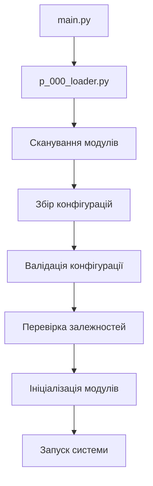

# 🏗️ ПОВНА ДОКУМЕНТАЦІЯ ПРОЄКТУ
*Автоматично згенеровано: 2025-12-13T17:18:54.700347*
*Оновлюється автоматично при кожному запуску системи*

====================================================================================================
## 📊 ЗАГАЛЬНА ІНФОРМАЦІЯ
====================================================================================================
- **Загальна кількість модулів**: 27
- **Секції конфігурації**: 14
- **Активних компонентів**: 34
- **Коренева папка**: D:\TTS\styletts2-ukrainian\007_universal


### 📦 CORE (1 модулів)
- `[0]` **p_000_loader** - Модуль P_000: ModuleLoader

### 📦 CONFIG (4 модулів)
- `[10]` **p_010_config_collector** - Модуль збирання конфігурацій.
- `[12]` **p_012_config_updater** - Модуль для автоматичного створення та оновлення основного config.yaml.
- `[15]` **p_015_config_tool** - Модуль утиліт для керування конфігурацією.
- `[20]` **p_020_config_validator** - Валідація конфігурації через Pydantic.

### 📦 SERVICES (6 модулів)
- `[50]` **p_050_universal_deps_checker** - Універсальний модуль перевірки залежностей.
- `[60]` **p_060_error_handler** - Модуль для обробки помилок завантаження модулів.
- `[70]` **p_070_event_types** - Загальні типи подій для всієї системи.
- `[75]` **p_075_events** - Система подій для комунікації між модулями.
- `[80]` **p_080_registry** - Реєстр дій для модулів.
- `[90]` **p_090_gui_manager** - Менеджер графічних інтерфейсів.

### 📦 UTILS (1 модулів)
- `[100]` **p_100_logger** - 

### 📦 FEATURES (11 модулів)
- `[303]` **p_303_tts_models** - p_303_tts_models.py - Завантаження та керування моделями TTS
- `[310]` **p_310_tts_config** - Конфігурація TTS модуля.
- `[312]` **p_312_tts_engine** - 
- `[351]` **p_351_sfx_handler** - p_351_tts_sfx_handler.py - Обробник звукових ефектів (SFX) для TTS системи.
- `[352]` **p_352_dialog_parser** - p_352_tts_dialog_parser.py - Парсер сценаріїв Multi Dialog для TTS.
- `[353]` **p_353_advanced_ui_core** - p_353_advanced_ui_core.py - Розширений UI для Multi Dialog TTS
- `[354]` **p_354_ui_builder** - 
- `[355]` **p_355_ui_handlers** - 
- `[356]` **p_356_ui_styles** - 
- `[357]` **p_357_ui_utils** - 
- `[400]` **p_400_test_integration** - Тестовий модуль для перевірки інтеграції TTS у фреймворк.

### 📦 INFO (4 модулів)
- `[901]` **p_901_project_info** - Модуль для документування проекту.
- `[902]` **p_902_ai_helper** - p_902_ai_helper.py - Спеціальний модуль для покращення документації під ШІ.
- `[910]` **p_910_github_url_updater** - p_910_github_url_updater.py
- `[996]` **p_996_gui_launcher** - p_996_gui_launcher.py - Покращений CLI для вибору та запуску GUI інтерфейсів

====================================================================================================
## 🔄 СХЕМА РОБОТИ СИСТЕМИ
====================================================================================================


====================================================================================================
## 🔗 ЗАЛЕЖНОСТІ МІЖ МОДУЛЯМИ
====================================================================================================
- **p_353_advanced_ui_core** ← p_354_ui_builder
- **p_354_ui_builder** ← p_356_ui_styles, p_355_ui_handlers, p_357_ui_utils

====================================================================================================
## 📝 ПРАВИЛА РОЗРОБКИ ДЛЯ ШІ
====================================================================================================

**Назви файлів:** `p_NNN_name.py` де NNN - тризначний префікс

**Префікси:**
- `000-009`: Ядро системи (loader)
- `010-029`: Конфігурація
- `050-099`: Базові сервіси
- `100-199`: Утиліти
- `200-899`: Бізнес-логіка та функції
- `900+`: Інформація та документація

**Обов'язкові функції:**
- `initialize(app_context)` - ОБОВ'ЯЗКОВА, ініціалізація модуля
- `prepare_config_models()` - опційно, для конфігурації
- `check_dependencies()` - опційно, перевірка залежностей
- `stop(app_context)` - опційно, очищення ресурсів

**Комунікація:** Тільки через `app_context`, НЕ через прямі імпорти!

**Приклад нового модуля:**
```python
# p_250_my_feature.py
from typing import Dict, Any
from pydantic import BaseModel

class MyConfig(BaseModel):
    enabled: bool = True

def prepare_config_models():
    return {'my_feature': MyConfig}

DEFAULT_CONFIG = {'my_feature': {'enabled': True}}

def initialize(app_context: Dict[str, Any]):
    logger = app_context.get('logger')
    logger.info('Мій модуль запущено!')
    return {'status': 'ready'}
```
